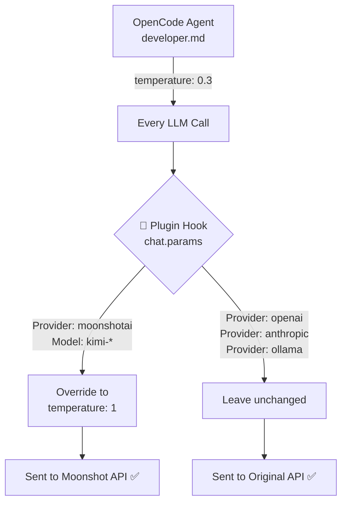

# 🌙 OpenCode Moonshot Compatibility Plugin

> **Tired of the `invalid temperature: only 1 is allowed for this model` error?**  
> This tiny plugin fixes it automatically — no need to change your agents! 🚀

---

## ✨ What It Does

When you use **Moonshot AI** (Kimi) models with OpenCode, the API only accepts `temperature: 1`.  
But OpenCode agents (like `@developer`) usually set lower temperatures (e.g. `0.3`) for better code quality.

This plugin **hooks into every LLM call** and silently forces `temperature = 1` **only** when the active model is a Moonshot / Kimi one.

Your other agents and models stay completely untouched! 🎯

---

## 🔧 How It Works



**Zero side effects** on other providers like OpenAI, Anthropic, Ollama, etc.

---

## 📦 Installation

### Option 1: npm (Recommended) 📦

```bash
npm install opencode-moonshot-compatibility
```

Then add to your `~/.config/opencode/opencode.json`:
```json
{
  "plugin": [
    "opencode-moonshot-compatibility"
  ]
}
```

### Option 2: Quick Copy

1. Download `index.js` from this repo
2. Place it in your OpenCode plugins folder:
   ```bash
   mkdir -p ~/.config/opencode/plugins
   cp index.js ~/.config/opencode/plugins/moonshot-temperature.js
   ```
3. Add to your `~/.config/opencode/opencode.json`:
   ```json
   {
     "plugin": [
       "file:///Users/YOUR_USERNAME/.config/opencode/plugins/moonshot-temperature.js"
     ]
   }
   ```

---

## 🧪 Supported Models

| Provider | Models |
|----------|--------|
| `moonshotai` | `kimi-k2`, `kimi-k2.5`, `kimi-k2.6`, `kimi-k2-thinking`, ... |
| Any provider | Any model ID containing `"kimi"` |

---

## 🛠️ Development

```bash
git clone https://github.com/iamvaleriofantozzi/opencode-moonshot-compatibility.git
cd opencode-moonshot-compatibility
```

The plugin is a single ESM file that exports a default async function returning hooks:

```js
export default async function () {
  return {
    "chat.params": async (input, output) => {
      // input.model.providerID  → "moonshotai"
      // input.model.id           → "kimi-k2.6"
      // output.temperature       → writable!
    },
  };
}
```

Learn more about OpenCode plugins: [https://opencode.ai/docs/plugins](https://opencode.ai/docs/plugins)

---

## 🐛 Troubleshooting

**Plugin not loading?**
- Check that the `file://` path in `opencode.json` is absolute
- Restart OpenCode completely (plugins are loaded at startup)
- Look for `[opencode-moonshot-temperature] PLUGIN LOADED` in the logs

**Still getting the temperature error?**
- Make sure you're using the latest version of this plugin
- Check that your model ID contains `"kimi"` or provider is `"moonshotai"`

---

## 💡 Why This Exists

I love using different models for different tasks in OpenCode.  
Switching to Kimi for coding is awesome, but the `temperature` mismatch was annoying.  
I didn't want to create separate agents just for Moonshot, so I built this universal fix! 🎉

---

## 📄 License

MIT — do whatever you want! 🏄‍♂️

---

## 👤 Author

Made with ❤️ by **Valerio Fantozzi**

- GitHub: [@iamvaleriofantozzi](https://github.com/iamvaleriofantozzi)
- Feel free to open issues or PRs!

Happy coding with Kimi! 🌙✨
